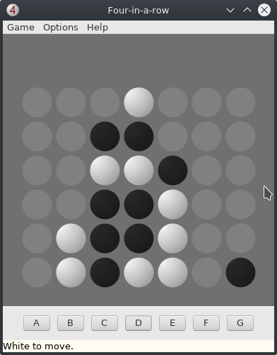

# Velena
Connect 4 engine by Giuliano Bertoletti, with a new GUI.

## Build instructions

You have to build the engine, which is a C program, and the GUI, which is a Lazarus project.

To build the engine, open a terminal in **engine** folder and type the following command:

    gcc -m32 -c *.c
    gcc -m32 *.o -o ../connect4

The engine must be compiled to 32-bit application, otherwise it doesn't work well. that's the reason of the `-m32` option.

To build the GUI, open with Lazarus the *c4.lpi* project in **ui** folder.

Both applications, *connect4\[.exe\]* and *c4\[.exe\]*, must be in the same directory, with *lang.cfg* (a language file) and *white_ob.cn4* (the opening book for the engine).
