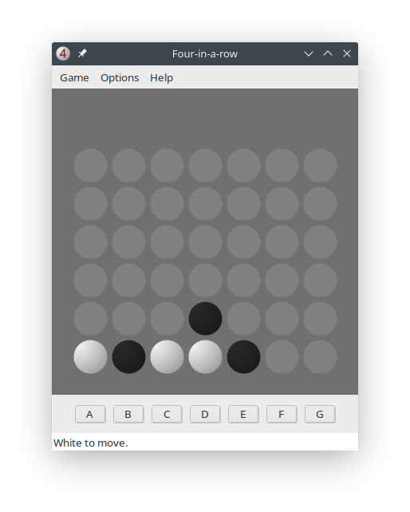

# Velena
Connect-Four engine by Giuliano Bertoletti, with an original GUI.

The GUI has been developed with Lazarus, using the [BGRABitmap](https://github.com/bgrabitmap/bgrabitmap) library.

## Build instructions

You have to build the engine, which is a C program, and the GUI, which is a Lazarus project.

To build the engine, open a terminal in **engine** folder and type the following command:

    gcc -m32 -c *.c
    gcc -m32 *.o -o ../connect4

The engine must be compiled to 32-bit application, otherwise it doesn't work well. This is the reason for the `-m32` option.

To build the GUI, open with Lazarus the **connect4g.lpi** project in **gui** folder.

Both applications, **connect4\[.exe\]** and **connect4g\[.exe\]**, must be in the same directory, with **lang.cfg** (a language file) and **white_ob.cn4** (the opening book for the engine).

## Language

You can change the language of the interface by starting the application with a parameter like, for example, `-l de-de` or `--lang=de-de` (for a german-speaking interface). Language currently available are french and german.

## Credits

The translation is done by means of [Lightweight Translation Manager](https://www.lazarusforum.de/viewtopic.php?t=11928) by Patrick Lampke.

The wood texture comes from the [5 wood textures](https://opengameart.org/content/5-wood-textures) package.
